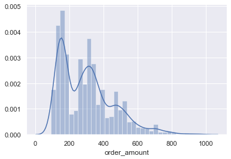

# Winter 2021 Data Science Intern Challenge

This project contain aswers for two question for winter 2021 Data Science Intern Challenge

## Question 1 

In this challenge I try to figure out how to work with some statistical metrics which need to track each online store using represented dataset.

### AOV

**Task:** a. Think about what could be going wrong with our calculation. Think about a better way to evaluate this data.

```
naive AOV = $3,145.13
```
What going wrong: 
If we calculate AOV for each store:
```
max AOV has store number 42 and it eqaul $235,101.49
min AOV has store number 92 and it equal $162.86
```
It's look like we have outliers in this dataset. Using _ describe()_ function I check quantitative values and decide to remove outliers from data set. I remove only around 1,5% of data and now my AOV looks more realistic for simple shoe store:

```
AOV = $301.84
```

### Additional metrics

**Task:** b. What metric would you report for this dataset?

Depends of data set (fields dataset presented us) we can add two more metrics:

* **Average basket value (ABV):**  How much money each customer bring to your store.

**Average basket value = Total Sold Items / Number of Checkouts**


* **Customer lifetime value (CLV):** How much profit can bring future relationship with a customer.

**Customer Value = Average Order Value x Purchase Frequency**

Where: 

**Purchase Frequency = Total Orders / Total Customers**

### Additional metrics value

**Task:** c. What is its value?
```
ABV = 1.99 items per basket
CLV = $4941.09
```

All my work saved in notebook [Question 1](./Question 1.ipynb)

## Question 2


### How many orders were shipped by Speedy Express in total?

```
54 orders was shipped by Speedy Express
```

### What is the last name of the employee with the most orders?

```
The last name of the employee with the most orders is Peacock.
```

### What product was ordered the most by customers in Germany?

```
Gorgonzola Telino was ordered the most by customers im=n Germany
```
All my work saved in notebook [Question 2](./Question 2.ipynb)